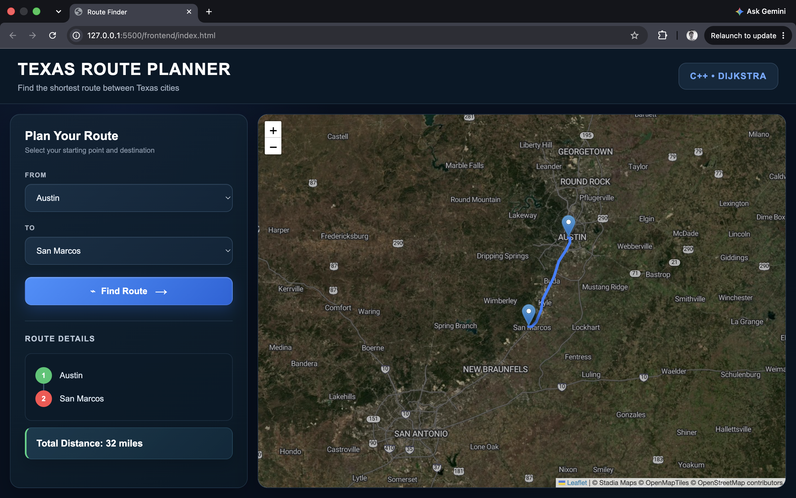

# Texas Route Planner

An interactive route-planning application that uses a C++ graph implementation and Dijkstra's algorithm to calculate the shortest path between Texas cities.

The project combines a C++ backend with a responsive web interface that visualizes routes on an interactive map.

## Demo



## Features

- Find the shortest path between Texas cities using Dijkstra's algorithm
- Model cities and roads as a weighted, undirected graph
- Display the calculated route and total distance
- Visualize routes on an interactive Leaflet map
- Display real road geometry using OSRM
- Add map markers for each city along the route
- Automatically zoom the map to the selected route
- Load road and city data from a file
- Handle disconnected cities and invalid selections
- Responsive interface for desktop and mobile

## Technologies

### Backend
- C++17
- Dijkstra's shortest-path algorithm
- Graphs and adjacency lists
- `std::unordered_map`
- `std::vector`
- `std::priority_queue`
- File I/O
- cpp-httplib

### Frontend
- HTML
- CSS
- JavaScript
- Leaflet
- OSRM

## How It Works

The C++ backend represents the Texas road network as a weighted graph.

Each city is a vertex and each road is a weighted edge:

```cpp
std::unordered_map<
    std::string,
    std::vector<std::pair<std::string, int>>
> adjacencyList;
```

When the user selects a starting city and destination, the frontend sends a request to the C++ server.

The server runs Dijkstra's algorithm to determine the shortest path and returns the path and total distance.

```text
Browser
   |
   v
JavaScript Frontend
   |
   | HTTP Request
   v
C++ Server
   |
   v
Graph + Dijkstra
   |
   | Shortest Path
   v
JavaScript
   |
   +----> Route Details
   |
   +----> OSRM
             |
             v
        Road Geometry
             |
             v
        Leaflet Map
```

OSRM is used only to obtain the road geometry for visualization. The shortest-path calculation itself is performed by the C++ implementation of Dijkstra's algorithm.

## Project Structure

```text
cpp-route-planner/
├── data/
│   └── roads.txt
├── frontend/
│   ├── data.js
│   ├── index.html
│   ├── script.js
│   └── style.css
├── include/
│   └── Graph.h
├── src/
│   ├── Graph.cpp
│   ├── main.cpp
│   └── server.cpp
├── third_party/
│   └── httplib.h
├── Makefile
└── README.md
```

## Running the Project

### 1. Compile

```bash
make
```

### 2. Start the C++ server

```bash
./server
```

The backend runs locally on port `8080`.

### 3. Start the frontend

From the project directory:

```bash
cd frontend
python3 -m http.server 5500
```

Then open:

```text
http://localhost:5500
```

## Example Route

```text
Amarillo
   ↓
Lubbock
   ↓
Midland
   ↓
Fort Stockton
   ↓
Van Horn
   ↓
El Paso

Total Distance: 585 miles
```

## Algorithm

Dijkstra's algorithm calculates the shortest path from the selected starting city to the destination.

A min-priority queue processes the city with the smallest known distance first. When a shorter path to a neighboring city is discovered, its distance and previous city are updated.

After reaching the destination, the previous-city relationships are used to reconstruct the complete route.

## Data Persistence

Road information is stored in:

```text
data/roads.txt
```

The C++ graph loads this data when the application starts, allowing the road network to persist between runs.